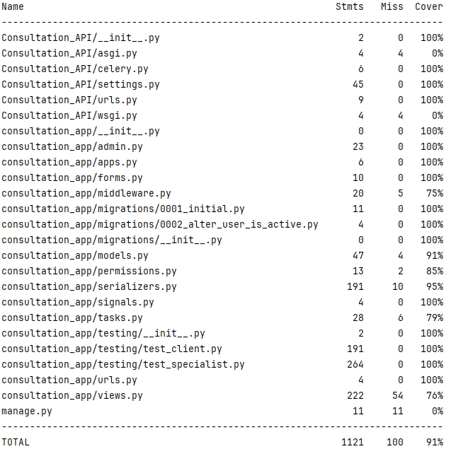

# API_Consultation

Сервис предоставляет возможность зарегистрированным клиентам записываться на консультации к различным специалистам. Проект выполнен с использованием фреймворка Django REST Framework (DRF) и включает контейнеризацию с помощью Docker Compose. Основные технологии: Docker, DRF, Django ORM, PostgreSQL, Redis, Celery, Simple JWT, drf-spectacular, pytest.

## Архитектура и контейнеризация
Проект контейнеризирован в Docker Compose и включает следующие сервисы:

- db: Контейнер с базой данных PostgreSQL;
- redis: Контейнер с Redis для кэширования и брокера задач;
- web: Контейнер с Django приложением, которое обслуживает запросы API;
- celery_worker: Контейнер с Celery worker для выполнения фоновых задач;
- pytest: Контейнер для запуска тестов с использованием pytest.

## Регистрация и авторизация
### Регистрация

Регистрация на портале происходит с помощью эндпоинта 
```
POST /api/registration/
```
В теле запроса необходимо передать username, email, password и одну из ролей: Client - для обычных пользователей, или Specialist - для специалистов. С помощью библиотеки ***uuid4*** генерируется индивидуальная ссылка-подтверждение и отправляется на почту вместе с логином и паролем. 

### Авторизация
```
POST /api/token/
```
Авторизация пользователей происходит с использованием JWT-токена и библиотеки ***Simple JWT***. По указанному эндпоинту пользователь вводит username и пароль и получает access и refresh токены. 

## Возможности специалиста
```
POST /api/create_slot/
```
Специалист по данному эндпоинту создаёт слот для записи клиентов. Необходимо указать date, start_time, end_time, поле context опционально, если необходимо сделать пометку. Предусмотрены ситуации, когда специалист указывает прошедшую дату, некорректное время, в таком случае в Response появляется ответ с описанием возникшей проблемы.

```
GET /api/specialist_slots/
```
Специалист получает список всех своих слотов.

```
PATCH /api/update_slot/
```
Эндопинт для изменения какой-либо информации о слоте: дате, времени. Присутствует возможность передать слот другому специалисту, если время слота не пересекается с уже существующими слотами второго специалиста.

```
DELETE /api/delete_slot/{id}/
```
Эндпоинт для удаления слота по его id.

```
PATCH /api/update_status/
```
Специалист может принять запрос на консультацию клиента, либо отклонить. В теле запроса необходимо передать id консультации и один из статусов: *Accepted* в случае принятия, *Rejected* для отклонения. Если специалист принимает консультацию, у соответствующего слота поле **is_available** становится равно False, и данный слот больше не показывается у других клиентов в списке доступных слотов для записи. При изменении статуса у консультации клиенту на почту приходит письмо с оповещением.

```
GET /api/specialist_consultations/
```
Эндпоинт для просмотра всех личных консультаций.

## Возможности клиента
```
GET /api/client_slots/
```
Эндпоинт для получения всех доступных для записи слотов. Выводятся слоты с датой и временем, которые начинаются сегодня или позже, и если это сегодняшний день, то начиная с текущего времени.

```
POST /api/create_consultation/
```
Эндпоинт для подачи запроса пользователем на консультацию. В теле запроса необходимо указать id выбранного слота. После этого специалист принимает или отклоняет запрос на консультацию.

```
GET /api/client_consultations/
```
Эндпоинт для получения клиентом всех личных консультаций.

```
PATCH /api/cancel_consultation/
```
При необходимости по данному эндпоинт клиент может отменить запись на консультацию. Необходимо указать id консультации и на выбор: cancel_comment для описания причины отказа или в поле cancel_reason указать одну из заготовленных причин: Health/Personal/Found_another_specialist/Other

## Возможности админа
```
POST /api/block_user/
```
```
POST /api/unblock_user/
```
По представленным эндпоинтам админы могут заблокировать и разблокировать любого пользователя по его id. Блокировка осуществляется при помощи кастомного ***middleware***, который на любой запрос будет возвращать Response: ***'error': 'Ваш аккаунт заблокирован'***

## Отправка email и уведомлений
Для асинхронной отправки email-уведомлений используются Celery и Redis.

## Тестирование
Код покрыт тестами с использованием библиотеки pytest. Тесты запускаются в контейнере, обеспечивая изоляцию и воспроизводимость.


